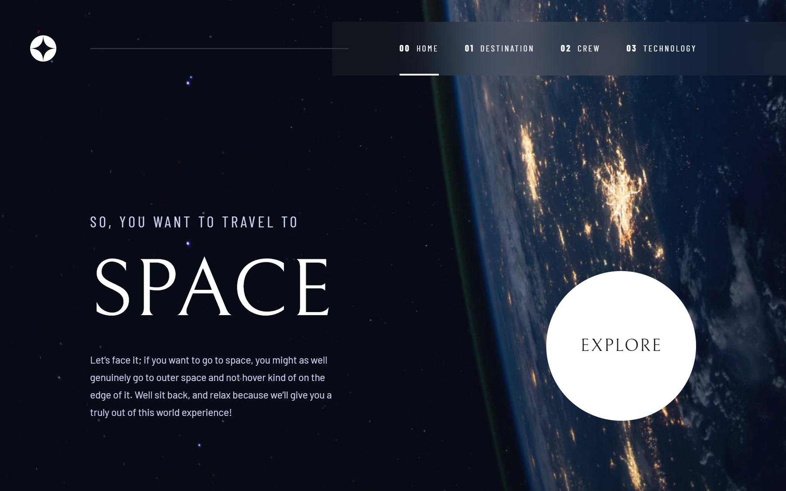

# Frontend Mentor - Space tourism website solution

This is a solution to the [Space tourism website challenge on Frontend Mentor](https://www.frontendmentor.io/challenges/space-tourism-multipage-website-gRWj1URZ3). Frontend Mentor challenges help you improve your coding skills by building realistic projects.

## Table of contents

- [Overview](#overview)
  - [The challenge](#the-challenge)
  - [Screenshot](#screenshot)
  - [Links](#links)
- [My process](#my-process)
  - [Built with](#built-with)
  - [What I learned](#what-i-learned)
  - [Continued development](#continued-development)
  - [Useful resources](#useful-resources)
- [Author](#author)

## Overview

### The challenge

Users should be able to:

- View the optimal layout for each of the website's pages depending on their device's screen size
- See hover states for all interactive elements on the page
- View each page and be able to toggle between the tabs to see new information

### Screenshot

### Links

- Solution URL: [Add solution URL here](https://your-solution-url.com)
- Live Site URL: [https://am-space-tourism-website.netlify.app/](https://am-space-tourism-website.netlify.app/)

## My process

### Built with

- [Astro](https://astro.build/)
- [Typescript](https://www.typescriptlang.org/)
- [React](https://reactjs.org/)
- [React Spring](https://www.react-spring.dev/)
- [Tailwind CSS](https://tailwindcss.com/)

### What I learned

I used this Frontend Mentor Challenge as my first project to be developed with the [Astro](https://astro.build/) framework. The process of completing this challenge taught me a lot about how Astro works in terms of project structure and content generation.

The ability to bring in other libraries (React, in this case) and use them as their own separate ["islands"](https://docs.astro.build/en/concepts/islands/#_top) within an Astro-generated page really gave me the freedom to try different approaches when creating the layouts provided by the challenge's design files.

### Continued development

I really need to work on gaining a better understanding of how good page responsiveness should be handled; this is something that gave me a bit of trouble throughout development. The main issue in this regard was being unsure of how to correctly handle users' ability to zoom or increase browser font size without breaking the look of the page. Ultimately, I ended up defining a set font size for the entire page, which I understand to be bad practice and should be avoided. This is an area of front-end web development that I will need to gain a better understanding of going forward.

Animations were also troublesome in terms of cross-browser consistency for mobile browsers. I found most animations to work as intended on Chrome, but appear very sluggish on Firefox. I need to find the proper way of reworking the way animations are used in order to maintain their intended effect for each web browser.

### Useful resources

- [Build your first Astro Blog](https://docs.astro.build/en/tutorial/0-introduction/) - This tutorial provided by the Astro docs was a great help in getting to understand the basics of the Astro framework.
- [How to break an image out of its parent container with CSS](https://gomakethings.com/how-to-break-an-image-out-of-its-parent-container-with-css/) - A blog post detailing a CSS trick I effectively used to make images within a flex container full width on mobile and tablet sizes.
- [Staggered list animation with CSS inline variables](https://www.youtube.com/watch?v=l_sRhY3uRYQ) - A YouTube video that helped provide the staggering animations used for page content elements.
- [How To Create Animated Numbers In React.js](https://www.youtube.com/watch?v=SsDtEq50xiQ) - A YouTube video which shows how to use the React Spring animation library to animate numbers, which I used for each of the destination page's content.
- [Avoiding trailing slashes in URLs on Astro Vercel deployments](https://noahflk.com/blog/trailing-slashes-astro) - This is a Blog post that helped in my understanding of how Astro handles trailing slashes of page routes and how to mitigate them if necessary.

## Author

- Website - [Antonio Mercado](https://amdev.work)
- Frontend Mentor - [@antmercado94](https://www.frontendmentor.io/profile/antmercado94)
- Twitter - [@FirstFoodShop](https://www.twitter.com/firstfoodshop)
